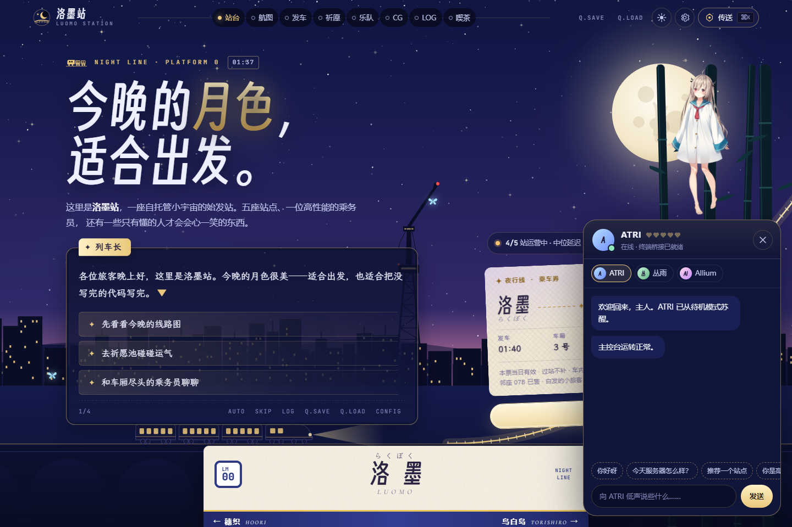

# 洛墨站 · 夜行线

**Luomo Home：一座自托管小宇宙的始发站。**

[线上网站](https://luomo.moe) · [部署指南](docs/DEPLOYMENT.md) · [素材与许可](ASSETS_ATTRIBUTION.md) · [参与贡献](CONTRIBUTING.md) · [MIT](LICENSE)



以夜行列车串起服务入口、项目、风景与 Live2D 伙伴。夜间是月台与星空，浅色主题是夏日海岛；使用 Next.js 16、React 19、TypeScript、Tailwind CSS、CSS Modules 和 PixiJS 构建响应式单页。

## 八个板块

| 板块 | 内容与交互 |
| --- | --- |
| 0 号站台 | SVG/CSS 绘制的月夜场景、可盖章车票；视觉小说对白支持逐字显示、AUTO、SKIP 和分支导航。 |
| 星轨航图 | 五座服务站点组成线路图，点击站名查看详情并前往服务。 |
| 发车信息板 | 聚合服务状态、延迟与更新时间，显示正点、晚点、停运等状态；获取失败可重试。 |
| 限定祈愿 · 作品展 | 切换作品卡池、单抽与十连、抽取结果与历史；含五星 90 抽保底和五五开机制，作品入口也可直接访问。 |
| Live House · 关于 | 以一人乐队介绍技术方向；六根吉他弦可用鼠标、触摸或键盘拨响，声音需手动开启。 |
| CG 鉴赏 | 八张生成风景插画，可放大、前后翻阅、隐藏文字框，并记录已看过的图片。 |
| 已读记录 | 按章节回顾服务建设与站点更新。对白框的 LOG 按钮会跳到这里。 |
| 终点站 · 喫茶 | 黑板彩蛋、按本地日期生成的每日御神签、月相估算；集齐 14 枚旅途记忆后显示另一结局。 |

页面还提供昼夜/跟随系统主题、`Ctrl/⌘ + K` 指令面板和 CONFIG 设置。`Q.SAVE / Q.LOAD` 保存与恢复浏览位置；祈愿、成就、CG 已读、车票、御神签与好感度等进度保存在当前浏览器，CONFIG 可清除本地进度。动效适配 `prefers-reduced-motion`，弹窗支持键盘操作与焦点恢复。

手机首屏暂缓渲染屏外板块；开场遮罩、屏外场景和后台页面会暂停场景动效，手机星空以 30fps 更新。乘务员通讯首次访问默认收起，打开后再加载 Live2D。优化的测量条件与结果见 [移动端性能记录](docs/mobile-performance-20261009.md)。

## 五个服务入口

| 站点 | 服务 | 公开入口 |
| --- | --- | --- |
| 监控空间站 | LuomoOps · 状态、日常运维与事件 | [ops.luomo.moe](https://ops.luomo.moe) |
| 文件星港 | LuomoFile · 文件、分享与存储 | [file.luomo.moe](https://file.luomo.moe) |
| 酒店前台 | LuomoAPI · 接口、密钥与权限入口 | [api.luomo.moe](https://api.luomo.moe) |
| 地下控制室 | LuomoTerminal · Web SSH、SFTP 与项目操作 | [terminal.luomo.moe](https://terminal.luomo.moe) |
| 机器人邮局 | AstrBot API · 机器人接口与自动化桥接 | [atri-api.luomo.moe](https://atri-api.luomo.moe) |

本仓库提供首页与状态聚合，五个后端服务独立部署。公开跳转地址在 [lib/services.ts](lib/services.ts)；服务端先请求各站 `/api/public/status`，失败时尝试 `/health`。首页各处共享 `/api/services` 请求，可见页面每分钟刷新，服务端默认缓存 30 秒；失败时保留上次有效数据。环境变量可覆盖探针来源，内部探针地址不会返回给浏览器。

## Live2D 与乘务员通讯

右下角通讯面板可切换 **ATRI、丛雨（Murasame）、Allium**，支持触摸反应、台词和好感度。ATRI 提供文本输入与快捷提问，经 `/api/atri/brain` 回复；丛雨与 Allium 提供本地陪伴台词和“换一句话”。ATRI 默认使用本地脚本回复，可配置外部 `atri-api` 桥接；外部调用失败会回退到脚本。

模型和 Cubism Core 是**独立的私有运行时素材**，不随源码分发。自行准备有相应 Web 展示与分发授权的素材，并按注册路径放置完整依赖：

```text
public/live2d/
├─ core/live2dcubismcore.min.js
├─ atri/atri_8.model3.json
├─ companions/murasame/Murasame.model3.json
└─ companions/allium/ariu/ariu.model3.json
```

每份模型还需其 JSON 引用的 `.moc3`、纹理及其他依赖。原生 Node 启动从 `public/live2d/` 读取；Docker 则将 `LUOMO_HOME_LIVE2D_PATH` 指定的素材目录只读挂载到该位置。`.gitignore` 与 `.dockerignore` 排除私有资源，提交时也应检查文件清单。缺少素材时显示静态回退，站点其他功能仍可使用。

`GET /api/companions` 报告 Core 与模型入口是否存在；`node scripts/inspect-live2d-models.mjs` 检查模型引用和能力，缺失时以非零状态退出。入口存在不等于完整模型已经成功渲染。参数记录见 [模型能力参考](docs/live2d-model-capabilities.md)。

## 本地启动

使用 **Node.js 22、npm 和 Git**，与 Docker/CI 的 Node 版本保持一致。

```bash
git clone https://github.com/luomo66ccff/luomo-home.git
cd luomo-home
npm ci
```

Windows PowerShell 复制配置：

```powershell
Copy-Item .env.example .env.local
```

macOS / Linux：

```bash
cp .env.example .env.local
```

按需调整配置，然后启动：

```bash
npm run dev
```

访问 `http://localhost:7891`。`dev` 和 `start` 默认监听 `0.0.0.0:7891`；需要仅本机访问或端口已占用时，可改用 `npx next dev -H 127.0.0.1 -p 37891`。生产模式使用 `npm run build` 后再运行 `npm run start`。

## 环境变量

完整模板见 [.env.example](.env.example)。原生 Node 可使用 `.env.local`，Compose 固定从 `.env` 读取；实际凭据保留在这些被 Git 忽略的文件中。

| 变量 | 用途与默认值 |
| --- | --- |
| `NEXT_PUBLIC_SITE_NAME` | 页面元数据品牌名，模板为 `Luomo Cloud`；页面视觉文案在组件与 `content/` 中。 |
| `NEXT_PUBLIC_SITE_URL` | canonical、站点地图和分享地址，模板为 `https://luomo.moe`。 |
| `LUOMO_OPS_URL`、`LUOMO_FILE_URL`、`LUOMO_API_URL`、`LUOMO_TERMINAL_URL`、`LUOMO_ATRI_API_URL` | 仅服务端读取的五个探针基地址；模板使用对应公开域名，不改变页面跳转入口。 |
| `STATUS_FETCH_TIMEOUT_SECONDS` | 单次探针超时，默认 `5` 秒，范围 1–15。 |
| `STATUS_CACHE_SECONDS` | 服务端缓存，默认 `30` 秒，范围 0–300。 |
| `ATRI_BRAIN_PROVIDER` | 默认 `scripted`；外部桥接设置为 `atri-api`。 |
| `ATRI_API_BASE_URL` | 外部 Brain 服务基地址，默认留空。 |
| `ATRI_API_BRAIN_PATH` | 外部聊天路径，默认 `/coze/atri/chat`。 |
| `ATRI_API_TOKEN` | 可选桥接凭据，通过 `X-Bridge-Token` 发送，仅服务端读取。 |
| `ATRI_API_TIMEOUT_MS` | 外部调用超时，默认 `8000` 毫秒，范围 1000–15000。 |
| `ATRI_ALLOW_SECRET_FORMS` | 允许受限形态，默认 `false`。 |
| `ATRI_ALLOW_DEBUG_FORMS` | 开发环境调试形态，默认 `false`，生产环境禁用。 |
| `ATRI_ALLOWED_ORIGINS` | 额外允许的请求来源，逗号分隔；模板为 `https://luomo.moe`，同源请求也允许。 |
| `ATRI_RATE_LIMIT_PER_MINUTE` | 单进程内按客户端标识限流，默认每分钟 `20` 次，范围 1–120。 |
| `LUOMO_HOME_HOST_PORT` | Compose 的宿主机端口，默认 `7891`。 |
| `LUOMO_HOME_LIVE2D_PATH` | Compose 的私有素材目录，默认 `./private-assets/live2d`；原生 Node 不读取此变量。 |

`NEXT_PUBLIC_*` 会进入公开构建产物，修改后需要重新构建；仅放公开信息。外部 Brain 需同时配置 provider、基地址及桥接所需凭据。反向代理的转发头设置和多实例限流注意事项见部署指南。

## 检查与部署

提交前运行：

```bash
npm run check:no-secrets
npm run typecheck
npm test
npm run build
```

启动服务后，可运行 HTTP 与浏览器回归：

```bash
npm run smoke
npx playwright install chromium
npm run visual:check
```

检查默认访问 `http://127.0.0.1:7891`；通过 `BASE_URL` 覆盖 smoke 地址，通过 `VISUAL_CHECK_URL` 覆盖浏览器地址。PowerShell 用 `$env:BASE_URL='http://127.0.0.1:37891'` 设置变量；bash 用 `BASE_URL=http://127.0.0.1:37891 npm run smoke`。浏览器可通过 `PLAYWRIGHT_CHANNEL=msedge` 或 `PLAYWRIGHT_EXECUTABLE_PATH` 指定，回归截图和报告写入新的 `output/playwright/tNNN/` 目录。

GitHub Actions 当前执行秘密扫描、Vitest 与生产构建；可选扩展模板见 [CI 补丁](docs/ci-upgrade-t003.patch)。`/health` 与 `/api/health` 返回健康状态，`/api/status` 返回首页自状态。`/live2d-test`、`/atri-brain-test` 仅供开发诊断，生产环境返回 404。

Docker 部署先复制 `.env.example` 为 `.env`，配置私有素材路径。若网络尚不存在，先执行 `docker network create luomocore_default`，再运行：

```bash
docker compose config
docker compose up -d --build
```

Compose 只发布到 `127.0.0.1:${LUOMO_HOME_HOST_PORT:-7891}`，使用外部网络 `luomocore_default`。镜像采用多阶段构建，以非 root 用户运行 Next.js standalone 服务；公网访问由反向代理或 Cloudflare Tunnel 提供。完整步骤见 [部署指南](docs/DEPLOYMENT.md)。

## 目录结构

```text
app/                    App Router 页面、API、全局样式与本地字体
components/home/        八个板块、系统层与 SVG/CSS 场景
components/             乘务员通讯、Live2D、ATRI、弹窗和共享状态
content/                板块、站点、卡池、CG 与章节文案
hooks/                  偏好、减少动效与 Brain 等 hooks
lib/home/               祈愿、月相、御神签、好感度、成就和本地存储
lib/                    服务探针、请求控制、Brain 与 Live2D 适配
public/assets/cg/       八张生成插画
public/live2d/          说明文件；私有运行时资源放置点（资源不提交）
scripts/                秘密扫描、HTTP/浏览器回归与模型检查
tests/                  Vitest 测试
docs/                   部署、模型参考与截图
```

字体子集生成与插画转换工具位于仓库外的 `tools/` 制作目录，新增汉字可能需要更新字体子集。字体原始许可保留在 `app/fonts/licenses/`，素材来源与处理说明见 [ASSETS_ATTRIBUTION.md](ASSETS_ATTRIBUTION.md)。

## 截图库与许可

| 预览 | 桌面 | 移动端 |
| --- | --- | --- |
| 夜行线 · 线上 Live2D | [桌面截图](docs/preview-nightline-desktop-t001.png) | [移动端截图](docs/preview-nightline-mobile-t001.png) |
| 夜行线 · t004 | [桌面截图](docs/preview-desktop-t004.png) | [移动端截图](docs/preview-mobile-t004.png) |
| 历史预览 · t003 | [桌面截图](docs/preview-desktop-t003.png) | [移动端截图](docs/preview-mobile-t003.png) |

源代码及本站代码绘制图形采用 [MIT License](LICENSE)。生成插画、第三方字体、Live2D SDK/Core、模型与角色形象按各自条款处理；MIT 不授予第三方角色或模型分发权。使用三套模型的注册路径不构成授权证明，详见 [素材与许可](ASSETS_ATTRIBUTION.md)。
