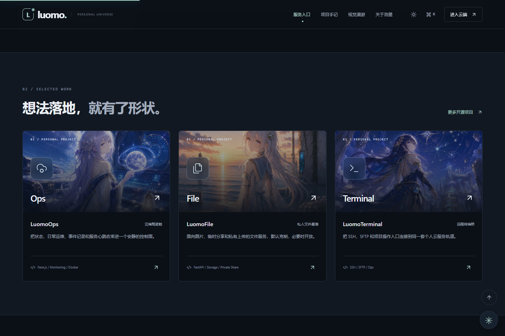

# Luomo Home 上线记录 · t005

2026-09-05，首页已部署到东京服务器，正式地址为 [luomo.moe](https://luomo.moe)。`www.luomo.moe` 通过 301 跳转至主域名，HTTPS、canonical、站点地图和健康检查均通过公网验证。

## 本次改动

- Terminal 项目封面替换为完整星空构图；画廊中同一张带白边的素材替换为完整驾驶舱画面。页面不再引用原白边图片，原始素材保留。
- 修复 Live2D 表情在角色销毁后才完成加载时产生的未处理 Promise 拒绝。表情和动作等待实际执行结果；已销毁模型的任务按取消处理，旧结果不会写入新模型的记录。
- 保留现有三位伙伴的私有模型，以只读目录接入新容器。生产进程使用非 root 用户，端口仅监听回环地址，并配置健康检查、日志轮转和自动重启。



## 发布与回滚

使用东京现有的 Cloudflare Tunnel 入口，保留其他域名与特殊路径路由。构建在独立 Linux 主机完成，再将校验过的 standalone 产物打包为 Node 22 Debian 容器，减少生产服务器的构建负载。

运行版本、源码提交和制品校验值统一记录在 [部署清单](deployment-manifest-t005.json)。本文件及验证截图属于后续交付文档，不改变该清单中已经运行的应用源码版本。

| 项目 | 位置 |
| --- | --- |
| 正式发布目录 | `/opt/luomo-home/releases/home-upgrade-t005` |
| 正式 Compose 配置 | `compose-runtime-t005.yml`，位于发布目录 |
| 生产容器 | `luomo-home` |
| 旧版容器 | `luomo-home-before-home-upgrade-t005`，停止状态 |
| 最初站点容器 | `luomo-home-before-home-upgrade-t004`，停止状态 |
| 最初站点完整备份 | `/opt/luomo-home-backups/home-upgrade-t004` |
| 私有模型只读目录 | `/opt/luomo-home/public/live2d` |

原 `/opt/luomo-home` 工作区及未提交文件均保留。后续管理本次发布时，应使用发布目录内的 Compose 配置，避免误用旧工作区的配置重建旧版。

只查看运行情况：

```bash
sudo docker compose -f /opt/luomo-home/releases/home-upgrade-t005/compose-runtime-t005.yml ps
curl --fail http://127.0.0.1:7891/health
```

需要回滚时，在东京服务器运行：

```bash
sudo python3 /opt/luomo-home/releases/home-upgrade-t005/cutover.py --rollback
```

该脚本校验容器身份，保留失败版本容器并恢复上一版本，再检查健康状态。它没有在正式站点执行过回滚演练；自动回滚分支与保留的旧容器不代表已实际演练成功。私有环境和备份只保存在服务器，禁止将完整配置或容器 inspect 输出公开。

## 实际验证

| 检查 | 结果 |
| --- | --- |
| Windows 与 Linux 单元测试 | 40 项通过 |
| TypeScript / Linux 生产构建 | 通过 |
| GitHub Actions 应用提交检查 | 通过，见部署清单中的运行编号 |
| 正式域名页面交互 | 57 项通过，14 张截图 |
| 三位模型的桌面 / 手机检查 | 29 项通过 |
| 慢网速表情加载中切换 / 关闭 | 6 次通过，无未处理错误 |
| 公网 HTTP、HTTPS、重定向与公开接口 | 15 项通过，smoke 通过 |

回归对照：旧版本在相同慢网速场景中，6 次都出现了异步表情错误；修复后的候选和正式域名均为 0 次。模型检查覆盖真实加载、切换、触摸反馈、画布数量和关闭后的资源释放，没有将其表述为全部动作或语音验收。

最终原始结果汇总在 [公网验证记录](verification-public-t005.json)。历史失败记录保留在本地 `output/playwright/models-t002`、`models-t003` 和 `race-t001`，未覆盖或改写。

## 现有外部状态

验收时 Ops、File、API、Terminal 四个服务正常。独立的 AstrBot API 入口返回 HTTP 530，首页如实显示离线；本次未更改该入口的路由。首页聊天使用 `scripted` 本地应答，尚未接入外部生成式回答。
