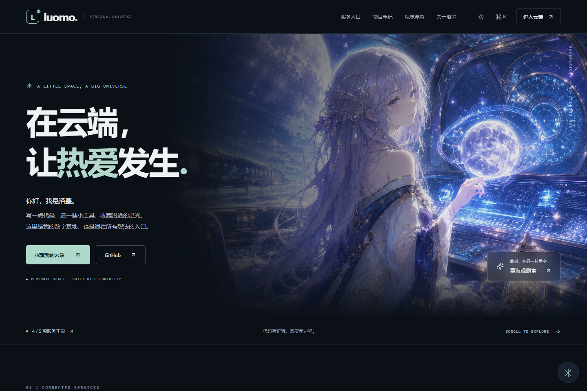
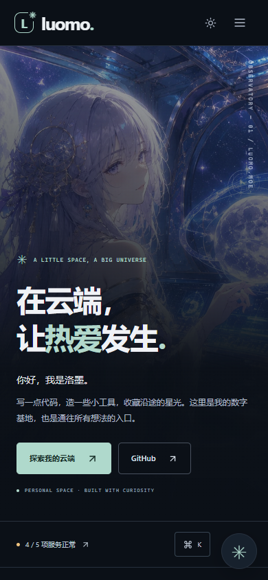

# 首页升级与回归报告 t003

日期：2026-09-05。基线：4f17fc0。工作分支：codex/home-upgrade-t003。

## 页面体验

首页改为深色云端观测站风格，以薄荷色、清晰字阶和大幅插画组织八个区块。重做导航、服务入口、项目展示、运行状态、画廊、个人介绍、构建记录和页尾入口；提供配套浅色主题。保留并复用仓库已有的图片资源。

- 首屏直接输出内容；图片按屏幕尺寸优化，画廊与下方图片延迟加载。
- 桌面与手机共用内容模型，支持 320 像素窄屏。
- 服务详情、画廊与指令面板采用原生模态对话框，支持 Escape、焦点恢复与键盘导航。
- 主题可持久化并跟随系统，粒子开关具有幂等行为，默认关闭额外粒子特效。
- 看板娘默认收起；展开为紧凑聊天面板。缺少私有模型时，页面和聊天仍可正常使用。

## 修复的确定问题

- 服务状态使用显式公开字段，不再返回内部探针地址；服务端合并并发请求、实现 TTL 缓存，页面各区块共享同一个状态来源。
- 明确区分正常、降级、离线和未知；HTTP 200 的 HTML 维护页不会被误报正常；全离线数据不会一直显示加载中。
- 状态请求支持超时、卸载取消、失败重试与保留上次有效记录；快捷指令的状态输出随刷新更新，完整匹配的指令优先于模糊结果。
- 无效 JSON、空消息、错误数据结构和过长消息返回 400；超过请求大小上限返回 413；保留同源控制和每进程限流。
- 聊天统一使用一个请求客户端；增加 20 秒超时、取消和带归属标识的聊天锁；HTTP/JSON 错误可见，失败保留草稿，IME 组合输入不会误发。
- 修复默认形态与拒绝文案乱码、形态事件结构、旧角色反应闭包、滚动闭包和临时对话结束后不恢复的问题。
- 先检查运行时模型挂载，再加载 Cubism/PIXI；缺资源不再反复报错。脚本加载有失败重试与时间上限，模型基线按实例保存，secret/debug 门禁分离，动作根据实际 manager 能力调用。
- 生产环境的两个诊断页面返回 404；canonical、robots、sitemap 和分享信息统一读取站点配置。
- Next.js 精确更新至 16.3.3，并更新兼容依赖。

## 验证

- TypeScript 类型检查和 Next.js 生产构建通过。
- Vitest：6 个文件，37 项测试通过。
- 生产 HTTP 冒烟通过；另验收 16 项 HTTP 场景，包括诊断页 404、无效请求 400、超大请求 413 和跨站请求 403。
- 浏览器回归：58 项检查、14 张截图；覆盖 1440/768/390/320 像素、明暗主题、普通/减少动态效果、弹窗焦点、画廊、指令、手机伙伴面板、真实聊天和故障恢复。真实数据流程无未预期浏览器错误。
- npm audit：0 个已知依赖漏洞。源代码与生产服务端/客户端构建目录的明显凭据标记扫描通过。
- 现有 GitHub Actions 保留原配置。新增生产服务器 HTTP/浏览器回归的配置已完成，但当前 GitHub OAuth 凭据缺少 workflow scope，远端拒绝了该文件的更新。可应用的改动完整保存在 [ci-upgrade-t003.patch](ci-upgrade-t003.patch)，取得工作流写权限后可执行 `git apply docs/ci-upgrade-t003.patch` 并提交。浏览器回归本身已在本地生产环境完成；远端现有 CI 状态以 PR 检查为准。

浏览器证据见 [verification-t003.json](verification-t003.json)，桌面与手机预览见下图。检查中的故障数据仅用于明确标注的模拟场景，截图使用真实状态接口；状态数字会随外部服务变化。

## 验证边界与部署

仓库没有私有 Cubism Core 与 ATRI/Murasame/Allium 模型，模型检查如实报告 3 项 MISSING 并以非零状态退出。已验证静态回退、无缺失资源请求和聊天；真实模型渲染、触摸区域、动作与声音需要合法模型素材后另行验证。未进行 Photoshop/Cubism 制作或伪造模型 QA。

配置语义见 [DEPLOYMENT.md](DEPLOYMENT.md)：LUOMO_*_URL 仅覆盖服务端探针，公开入口在 lib/services.ts 中维护；反向代理必须覆盖客户端转发头，多实例需要边缘共享限流。

这次交付为独立分支和草稿 PR，不自动合并或部署线上。代码可通过还原本次提交回滚；不涉及数据库迁移或源素材变更。本次审计与回归不能证明不存在尚未触发的问题。
